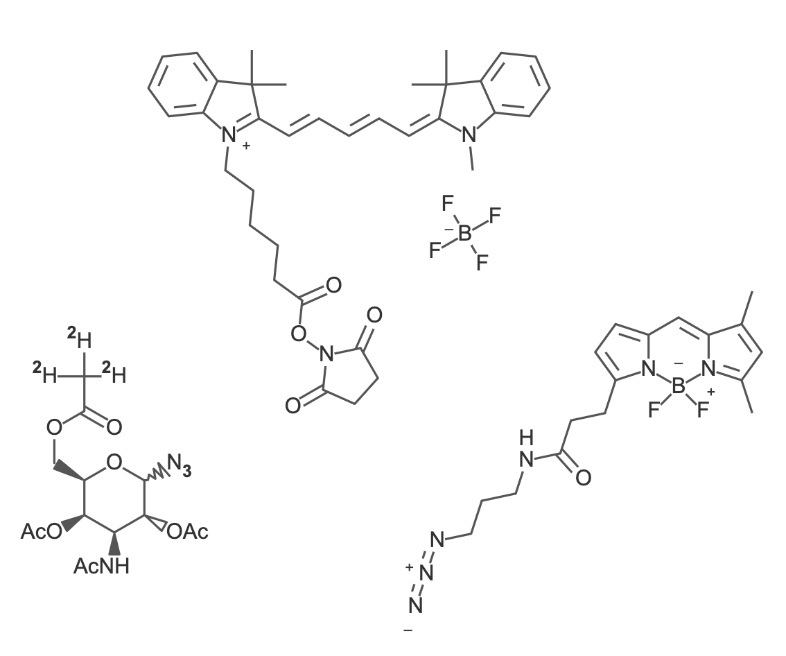
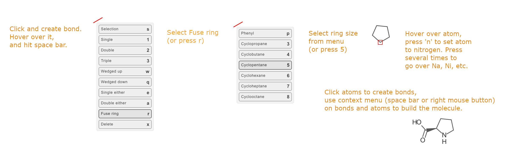
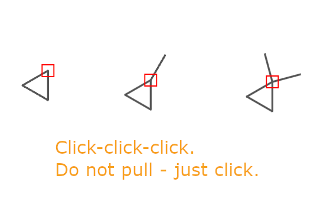
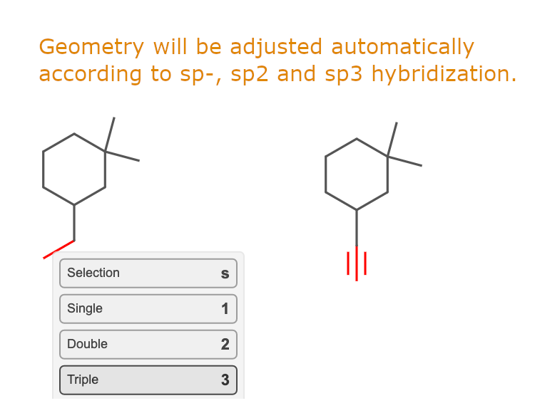
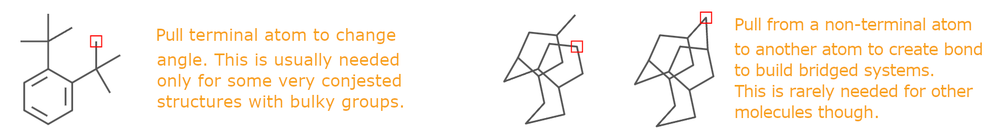

# Butlerov

Butlerov is a free, open-source 2D chemical structure editor written in TypeScript and built on [Konva.js](https://konvajs.org/).The package is named after Alexander M. Butlerov (1828-1886), a Russian chemist who proposed the idea that order of atom connection matters for organic compounds, so basically introduced chemical structures.

The editor is aimed at fast drawing with keyboard, mouse, and a context menu. The interaction model is closer to Blender 3D than to other chemoinformatic editor UIs (ChemDraw, MarvinSketch, and similar): emphasis is on predictable, symmetrical layouts rather than “pull every bond by hand,” which pays off when collecting user-supplied databases of chemical structures.


Today Butlerov focuses on a **single structure** per canvas; broader **scheme** editing is evolving toward full 2D reaction-diagram workflows.

---

## Features

- **File formats:** read and write MDL **MOL** / **SDF** (and related string workflows via converters in code).
- **Drawing:** chains, rings, fused systems, single and multiple bonds.
- **Annotations:** charges, isotopes, superatoms / abbreviations (e.g. CO₂H, TMS).
- **Editing:** unlimited undo/redo, symmetry tools for neat layouts.
- **Analysis:** brutto formula, exact mass, and molecular weight from the current structure.
- **Integration:** use the **core** library in plain HTML/JS, the **Vue 3** wrapper in apps, or try the **desktop** shell (Electron)—see [Packages](#packages) below.

---

## Using the editor

1. **Mouse:** click on atoms and bonds to build and edit the structure. Pan with shift-left button.
2. **Keyboard:** letter keys map to element symbols where applicable; other shortcuts speed up drawing (e.g. chain and ring tools). Keep the canvas focused so key events reach the editor (the Vue component can **autofocus** the stage on mount).
3. **Context menu:** with the pointer over an **atom** or **bond**, press **Space** to open the menu. Menu entries show the relevant **hotkeys**—use them for faster work once you learn the layout.

If you embed Butlerov in a form or database UI, wire `onchange` (core) or `v-model` (Vue) so your app saves MOL/SMILES/native JSON-based graph format when the structure changes.


## Sample drawing

Here are some sample structures drawn with Butlerov.



## Live demo (CodePen)

**[Butlerov demo on CodePen](https://codepen.io/eizemazal/pen/ExQzmoJ)**

## How to use it?

Ever wondered why professional all graphic editing tools make heavy use of keyboard? Because this is fast and efficient. Same is related to Butlerov - use your mouse and keyboard.

Context menu is opened on right mouse button click or space bar. It is different for bonds and atoms, and available options may vary. The menu contains keyboard shortcuts. You can select menu item by mouse, or by pressing keyboard shortcut.
So, fusing a cyclopentane ring is as simple as hovering over some bond to make it appear red (active), pressing space bar to open menu, then r (fuse ring), and then 5. Just three keyboard strokes, so there is no time-consuming toolbar with tools to select.



Changing atom is just hovering over it and pressing first letter of its symbol. For s, this will change Se-Si-Se-Sn-Sb-...-S. Shift-s will change in backward order. + and - increase and decrease charge. Dot `.` adds oxo group (=O). This and almost all other shortcuts can be learned from context menu.

Except for some rare cases, you need not pull the bonds to build neat structures. Just click, and the geometry will be adjusted. You can press Ctrl-Z to undo any action.



Molecule shape will be adjusted automatically for sp-hybridized linear geometries, for tetrahedral sp3 and trigonal sp2 / trisubstituted atoms.



Pulling bonds is generally discouraged, but it is possible to adjust geometry in conjested systems, and to build bridged polycyclic molecules.



Shift-left mouse button to pan canvas.
Ctrl-Click (Cmd-Click on Mac) to create lone atom that can be later converted into counterion.


Try the latest editor in the browser (no install):


Use the mouse and keyboard together; open the context menu with **Space** over a bond or atom. Hotkeys are listed in the menu.

---

## Packages

| Package | Description |
|--------|-------------|
| [**Core (`@butlerov-chemistry/core`)**](packages/core/README.md) | Konva-based editor: embed in **vanilla JS** or any bundler. |
| [**Vue (`@butlerov-chemistry/vue`)**](packages/vue/README.md) | Vue 3 component: **`v-model`**, props, copy control. |
| [**Desktop app**](packages/app/README.md) | Electron application — **under active development**. |

---

## Developing Butlerov

Contributions are welcome. This repository is an npm **workspaces** monorepo.

Clone, install, build, and open the local HTML demo:

```bash
git clone git@github.com:eizemazal/butlerov.git
cd butlerov
npm i
npm run dev
# navigate to http://localhost:5173/ to see test page
```

`demo/test.html` loads the built UMD bundle from `packages/core/dist/` after `npm run build`.

Run tests:

```bash
npm run test
```


The project uses ESLint; a VS Code ESLint setup works well for day-to-day work.


---

## License

Butlerov is developed for use in cheminformatics projects by Lumiprobe Group.  
Released under the **MIT** license for commercial and non-commercial use.
